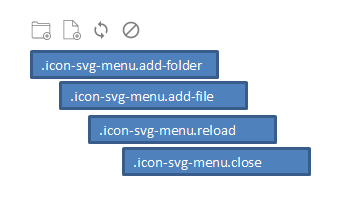
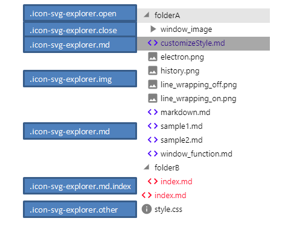

# Customize style

You can change the style by placing `style.css` in the root directory.

After changing, please press update button.


## system default

```css
title:style.css
.highlight-title {
  position: absolute;
  background-color: gray;
  color: white;
  left: 0;
  right: 10px;
  white-space: pre;
}

.highlight-title::before {
  content: "";
}

.highlight-code {
  padding-left: 0.5em;
}

.external-link::after {
  content: "↗";
}

.internal-link {
  color: -webkit-link;
}

.no-link {
  color: red;
}

:focus {
  outline-color: gray;
}

.icon-svg-explorer {
  display: inline-block;
  min-width: 20px;
  width: 20px;
  height: 20px;
  fill: gray;
}

.icon-svg-explorer.close {
  fill: gray;
}

.icon-svg-explorer.open {
  fill: gray;
}

.icon-svg-explorer.md {
  fill: blue;
}

.icon-svg-explorer.md.index {
  fill: red;
}

.icon-svg-explorer.img {
  fill: gray;
}

.icon-svg-explorer.other {
  fill: gray;
}

.icon-svg {
  display: inline-block;
  width: 30px;
  min-width: 30px;
  height: 30px;
  fill: gray;
}

.icon-svg:hover {
  cursor: pointer;
}

.icon-svg.toggle {
  fill: black;
}

.icon-svg.wide {
  fill: gray;
}

.icon-svg.add-folder {
  fill: gray;
}

.icon-svg.add-file {
  fill: gray;
}

.icon-svg.reload {
  fill: gray;
}

.icon-svg.close {
  fill: gray;
}

.explorer-item .name {
  color: unset;
}

.explorer-item .name.right-click {
  color: pink;
}

.explorer-item .name.index {
  color: red;
}

.icon-svg-menu {
  display: inline-block;
  min-width: 20px;
  width: 20px;
  height: 20px;
  fill: gray;
  padding-left: 10px;
}

.icon-svg-menu:hover {
  cursor: pointer;
}

.icon-svg-menu.add-folder {
  fill: gray;
}

.icon-svg-menu.add-file {
  fill: gray;
}

.icon-svg-menu.reload {
  fill: gray;
}

.icon-svg-menu.close {
  fill: gray;
}

#marked img.set-lightbox {
  border: solid 1px blue;
}

```

## easy explanation

### menu icon

```css
.icon-svg-menu:hover {
  cursor: pointer;
}

.icon-svg-menu.add-folder {
  fill: gray;
}

.icon-svg-menu.add-file {
  fill: gray;
}

.icon-svg-menu.reload {
  fill: gray;
}

.icon-svg-menu.close {
  fill: gray;
}

```




### explorer icon

```css
.icon-svg-explorer.close {
  fill: gray;
}

.icon-svg-explorer.open {
  fill: gray;
}

.icon-svg-explorer.md {
  fill: blue;
}

.icon-svg-explorer.md.index {
  fill: red;
}

.icon-svg-explorer.img {
  fill: gray;
}

.icon-svg-explorer.other {
  fill: gray;
}
```




### lightbox

```css
#marked img.set-lightbox {
  border: solid 1px blue;
}
```


